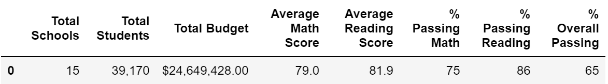

# School-District-Analysis

## Project Overview

The purpose of this project was to perform exploratory data analysis and create summary statistics on data from a school district. The data includes every student and their math/reading grades, as well as information such as the school's size and budget. After performing the inital analysis, it was discovered that there was a case of academic dishonesty involving 9th graders at Thomas High School. The math and reading scores for every 9th grader from Thomas High School were changed to NaNs and the analysis was performed again.

## Results

- How is the district summary affected by the change in scores?
  - The district summary is only very slightly affected by the change in scores. As seen below, the percentages of students passing math, reading, and both marginally increased. Similarly, the average math score marginally decreased.
  - Before Changes: 
  - After Changes: 
- How is the school summary affected by the change in scores?
  - The percentage of students passing math, reading, or both slightly decreased after the change in scores.
- How does replacing the ninth graders’ math and reading scores affect Thomas High School’s performance relative to the other schools?
  - After the changes, Thomas High School still remains the second highest performing school in the district.
- How does replacing the ninth-grade scores affect the following:
  - Math and reading scores by grade
    - Tenth to 12th graders's grades are unaffected. The average grade for 9th grader becomes NaN because there is no data available.
  - Scores by school spending
    - The scores by school spending is not affected in any significant way.
  - Scores by school size
    - The scores by school size is not affected in any significant way.
  - Scores by school type
    - The scores by school type is not affected in any significant way.

## Summary

This is a versatile script that can be used to calculate the results of any election where data is stored in a CSV file. To make this script run analysis for any election, a few simple modifications need to be made. The correct file name and path needs to be coded into Line 9 of the script. The script can also be expanded to show the county with the lowest voter turnout. This could be useful if running analysis on elections with dozens of counties involved.
